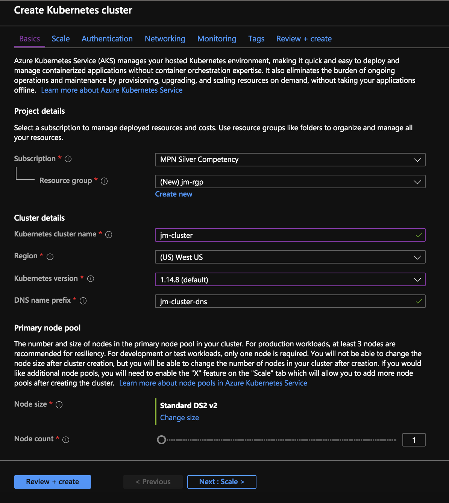
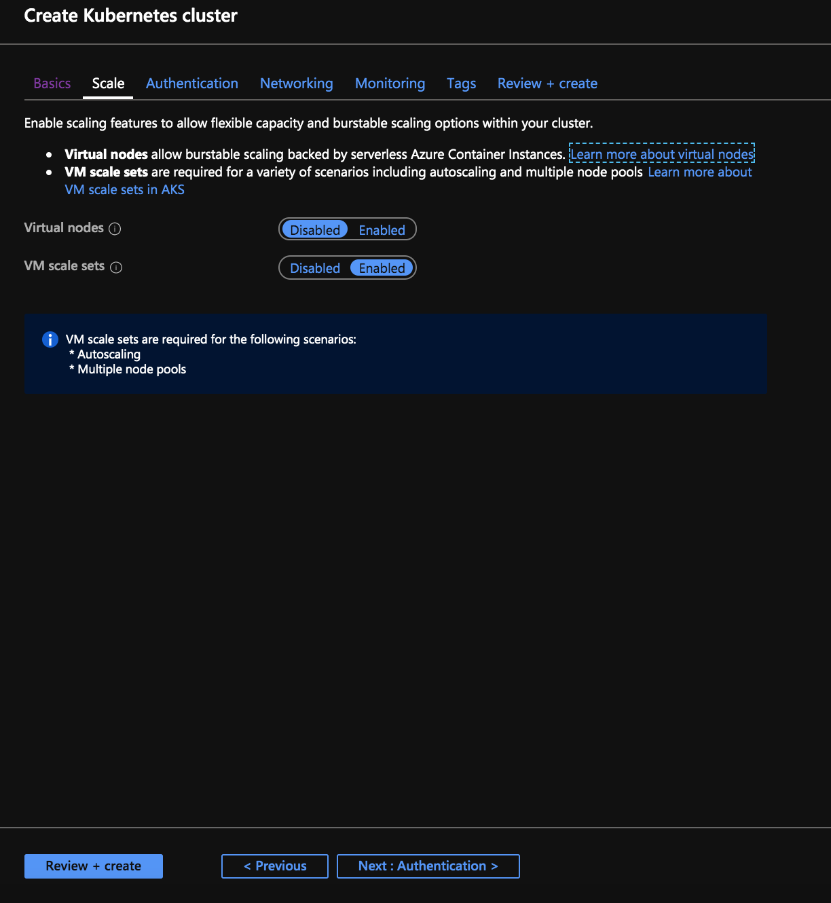
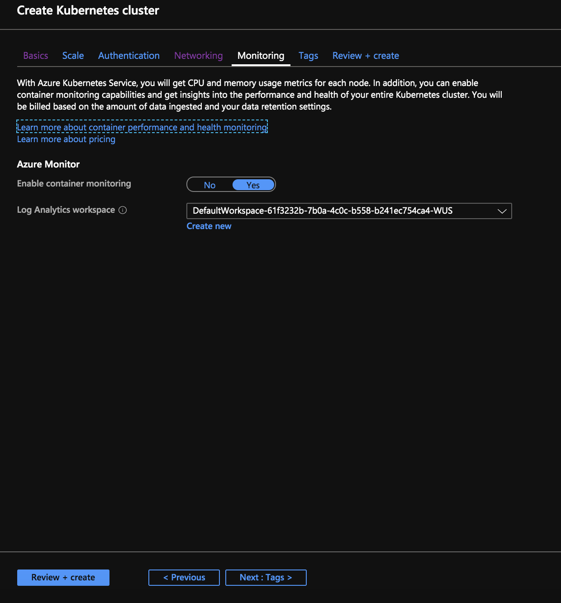
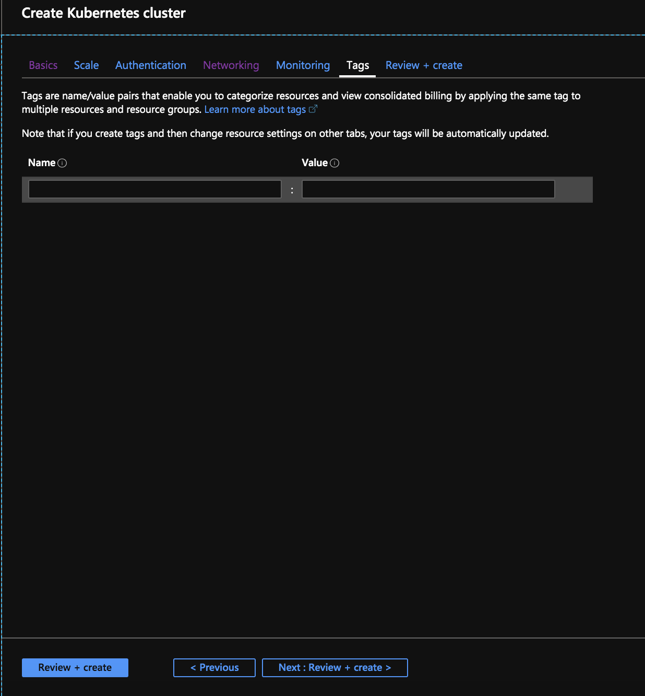
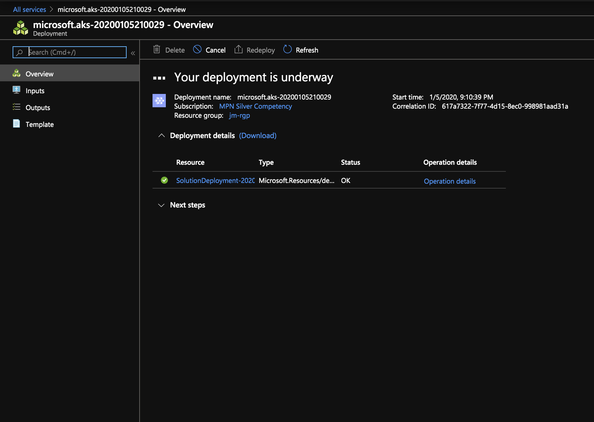

# AKS

Azure Provides a managed Kubernetes cluster service, that you can utilize to deploy your workloads.

In this section, we will walk through setting up an AKS cluster, which you can use to experiment in the coming sections and demonstrations.

## Pre-Reqs

1. You need to have access to an existing Azure subscription.
2. You will need to install the latest `azure-cli` tool. `azure-cli (2.0.45)`

## Steps

1. Log into the Azure Portal Dashboard
2. Click on "All services" in the top left corner.
	- 
3. Search for `aks` and select "Kubernetes services".
	- 
4. Click the `Add` button to create a new Cluster.
	- 
5. Fill in appropriate information for the Basic Tab
	- 
6. Fill in appropriate information for the Scale Tab
	- 
7. Fill in the appropriate information for the Authentication Tab
	- 
8. Fill in the appropriate information for the Networking Tab
	- 
9. Fill in the appropriate information for the Monitoring Tab
	- 
10. Add any tags, you feel may be appropriate in the Tags Tab.
	- 
11. Click "Review + Create" Tab and then allow it to Validate
	- 
12. Once validation has passed, click Create
    - 
13. This can take about 30-45 minutes to complete, and you should be able to see your cluster.
	- 
14. Click on your cluster, and then the Overview Tab.
	- 
15. In your command line, type `az login` and follow the instructions.
16. Run `az aks install-cli` to install `kubectl` into your local environment.
17. Run `az aks get-credentials` with your flags to set the kubectl context.

## Validate

After performing the steps above, you should be able to run the following command, and see some Pods running.

`kubectl get pods --all-namespaces`

## Creating Node Pools 

The Azure Portal UI has some limitations, in terms of managing the node pools, as much of the functionality is in preview. Its recomended to get familiar with the az cli approach.

https://docs.microsoft.com/en-us/cli/azure/ext/aks-preview/aks/nodepool?view=azure-cli-latest#ext-aks-preview-az-aks-nodepool-add

## Enabling SSH

We will follow the azure docs for getting ssh access.

https://docs.microsoft.com/en-us/azure/aks/ssh

## Continuing

The next sections wll explain kubectl, and give you a chance to flex some of these actions against your AKS cluster.
