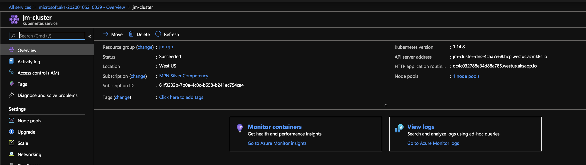

# Container Registry

Lets setup an Azure Container Registry that we will also use with our cluster.

In the Azure Portal, search for Container Registries and navigate to the list.

1. Click add and fill in the appropriate information. (enable admin user)
	- 
2. This can take a few minutes to complete, when its finished click into the resource.
3. On the "Access Keys" tab, find the registry, username, and password for your registry.
4. Go ahead and log in to your registry using the following command, substituting your values.
    - `docker login redaptregistry.azurecr.io -u redaptregistry -p XXXXXXXXXXXXXXXXXX`

## Continuing

In a later section, we will build and deploy a sample application using the cluster and the registry.